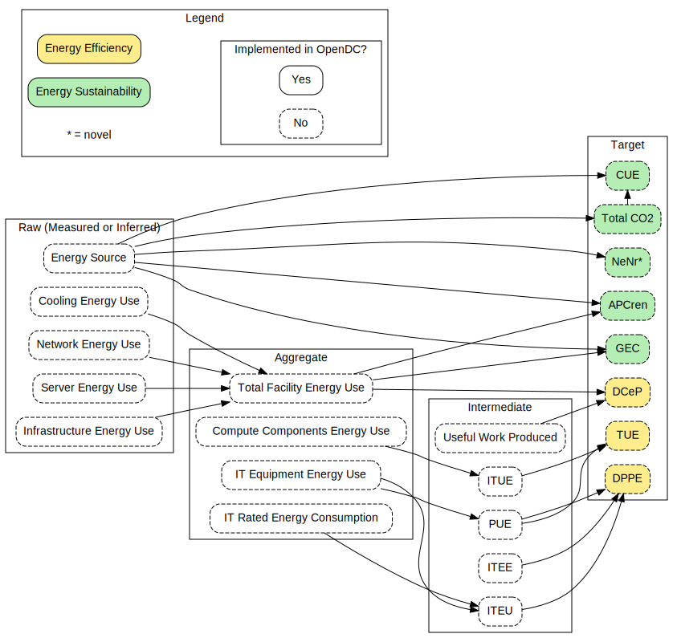

# Metric Selection

A graph of energy efficiency and sustainability metrics and their component breakdown. 
 
 Nodes are categorized into the following:
- **Target** metrics are those which we aim to report to the end user
- **Intermediate** metrics are sub metrics which are needed in a target metrics formula
- **Aggregate** metrics are a simple combination of the same raw measurement from different sources
- **Raw** measurements are the data produced by the datacenter or input from specification of hardware

An edge A --> B means that A is used in the calculation of B.

# Graphviz
The graph is defined using [graphviz] (http://www.graphviz.org/). Graphviz allows you to specify the graph and its properties through a script. Visual layout is produced automatically, and can be configured through the scripting language. 

# Output
The best way to view the graphs would be through a graphviz visualizer such as the [Graphviz Interactive Preview] (https://marketplace.visualstudio.com/items?itemName=tintinweb.graphviz-interactive-preview) for Visual Studio Code or any [other] (https://graphviz.org/resources/) whichs allows you to click node URL's and see tooltips (for full node name).

With graphviz installed on your system you can also export the graph directly into various formats. Some example formats are (for windows):

- SVG (clickable nodes & tooltip): `dot -Tsvg metrics.gv -o metrics.svg`

- PNG: `dot -Tpng metrics.gv -o metrics.png`

- PDF: `dot -Tpdf metrics.gv -o metrics.pdf`

_metrics.svg_ in root represents the latest graph.